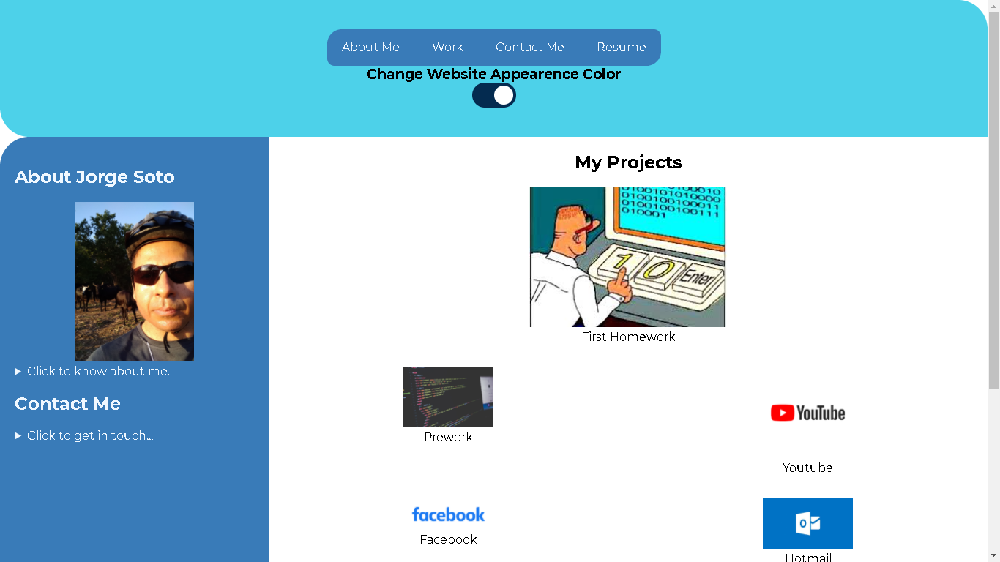

# jorgesoto-homework-march-16-21
# Description
The goal of this website is to showcase the skills I have gotten during the CSS course.

For this reason I have built and deploy this protfolio website.

This one is composed of:

* Navigation Header
* Sidebar Section
* About Me Section
* Contact Me Section
* Projects Section
* Footer Section

# Website Project Image

# Website Link
[Jorge Soto Portfolio](https://jorgeatcabo.github.io/jorgesoto-homework-march-16-21/)

